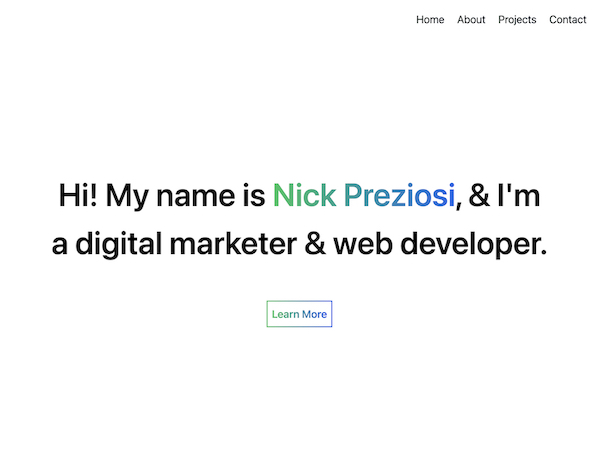

# Nicholas Preziosi Portfolio Site

This portfolio site showcases my most recent projects/work and is updated frequently! I gained a solid understanding of Tailwind CSS by using it in this project in order to create a sleek, responsive design.

    <a href="https://www.nicholaspreziosi.com/">
        
        </img>
    </a>

## Technologies Used

    <li style="margin: auto">
        
        HTML
    </li>
    <li>
        
        JavaScript
    </li>
    <li>
        
        Tailwind CSS
    </li>

## Link to Site

View my portfolio site [here](https://www.nicholaspreziosi.com/).
